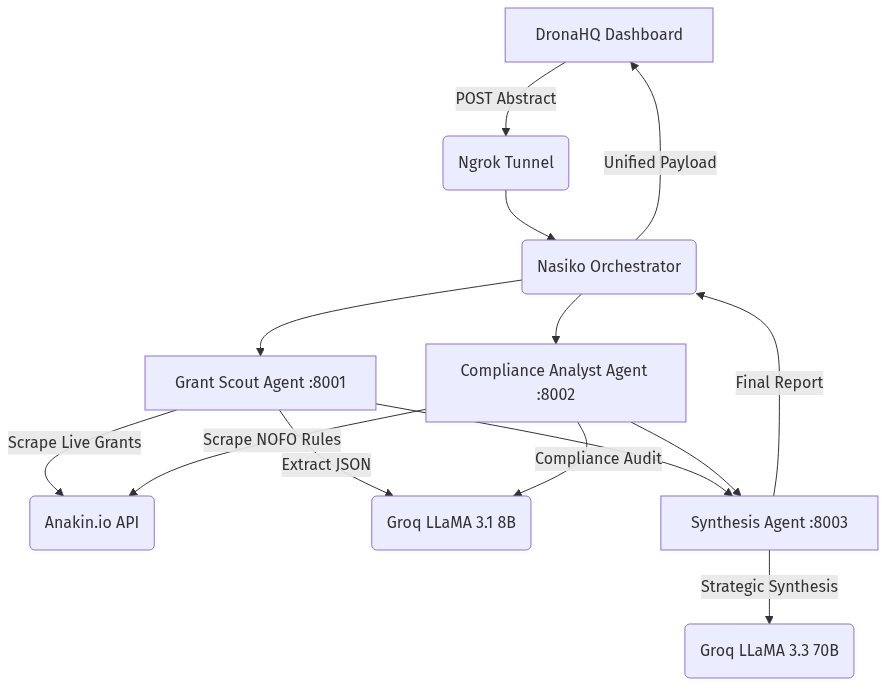

# 🏆 GrantMatch AI — System Architecture & Technical Documentation

**GrantMatch AI** is an intelligent grant discovery and proposal alignment platform designed to streamline funding research for researchers, startups, and NGOs by converting months of hunting funding opportunities into automated, sub-minute compliance briefs.

---

## 📐 System Architecture

GrantMatch AI operates on an **Agent-to-Agent (A2A) Microservices Architecture** orchestrated by **Nasiko**, connected to a **DronaHQ** web interface, powered by **Anakin.io** for live web scraping, and driven by **Groq** for ultra-fast LLaMA inference.

### Architectural Flowchart




### Execution Pipeline

1. **Abstract Ingestion**: User inputs a research or startup abstract into the **DronaHQ Dashboard**.
2. **Task Routing**: DronaHQ triggers an HTTP POST request through **Ngrok** to the **Nasiko Orchestrator**.
3. **Parallel Discovery & Auditing**:
   - **Grant Scout** calls **Anakin.io** to search active databases (Grants.gov, NSF, NIH) and passes raw listings to **Groq (LLaMA 3.1 8B)** to extract structured grant opportunities.
   - **Compliance Analyst** queries **Anakin.io** for detailed NOFO/RFP eligibility criteria and uses **Groq** to measure project alignment and detect compliance gaps.
4. **Strategic Synthesis**: The **Synthesis Agent** receives aggregated data from the Scout and Analyst, prompting **Groq (LLaMA 3.3 70B)** to construct a strategic readiness score, actionable recommendations, and a funder-tailored proposal outline.
5. **Dashboard Rendering**: Results flow back through Nasiko to update the DronaHQ dashboard UI in real time.

---

## 🛠️ Tools Used & How They Are Used

| Tool / Technology | Role in Architecture | Implementation Details |
| :--- | :--- | :--- |
| 🖥️ **DronaHQ** | **User Dashboard & Frontend UI** | Provides a drag-and-drop, low-code interface containing abstract input forms, live agent execution status trackers, and interactive report rendering (Match Score %, Gap Analysis, Specific Aims Draft). |
| 🧠 **Nasiko** | **Agent-to-Agent (A2A) Orchestrator** | Coordinates multi-agent workflows via the A2A protocol. Routes tasks between individual microservices, handles dependency graphs, and monitors state execution. |
| ⚡ **Groq** | **Ultra-Fast LLM Inference Engine** | Delivers 500+ tokens/sec inference speed using state-of-the-art models:<br>• `llama-3.1-8b-instant`: Rapid JSON extraction of grants and compliance rules.<br>• `llama-3.3-70b-versatile`: Complex strategic synthesis and proposal writing. |
| 👁️ **Anakin.io** | **Live Grant Data & Guidelines Scraper** | Directly queries and converts live grant portals (Grants.gov, NSF.gov, NIH.gov, private foundation sites) into clean markdown text for LLM parsing without reliance on static databases. |
| 🐍 **FastAPI & Uvicorn** | **Agent Microservices Framework** | Hosts lightweight Python microservices for each specialist agent (`Grant Scout` on port 8001, `Compliance Analyst` on port 8002, `Synthesis` on port 8003). |
| 🌐 **Ngrok** | **Secure Tunneling Gateway** | Exposes local development microservices and the Nasiko orchestrator running on `localhost:8080` to cloud-based services like DronaHQ over HTTPS. |

---

## 🚀 What Makes GrantMatch AI Unique?

1. **Autonomous Multi-Agent A2A Collaboration**
   Unlike simple single-prompt RAG chatbots, GrantMatch AI breaks grant application auditing into specialized autonomous roles (Scout, Compliance Auditor, Synthesis Director) that cross-verify findings independently before generating the final report.

2. **Real-Time Live Web Scraping (No Stale Databases)**
   Most grant search tools rely on outdated static databases. By leveraging Anakin.io, GrantMatch AI queries live Notice of Funding Opportunities (NOFOs) and RFP portals directly at execution time.

3. **Sub-60-Second Full Compliance & Alignment Audit**
   By combining Groq's high-speed inference engine with parallel agent execution, the platform reduces weeks of manual guideline auditing into a comprehensive alignment strategy generated in under 1 minute.

4. **Funder-Tailored Proposal Synthesis**
   Beyond simple keyword matching, the Synthesis agent generates an optimized proposal summary specifically mapped against the funder's exact evaluation rubric.

5. **Seamless Low-Code / Pro-Code Hybrid Stack**
   Integrates an intuitive no-code user interface (DronaHQ) with pro-code agent microservices (FastAPI) and enterprise-grade orchestration protocols (Nasiko).

---

## 🔗 GitHub Repository Access

Access the full source code, agent implementations, and setup scripts here:

👉 **[GrantMatch AI GitHub Repository](https://github.com/Geetheshwar420/GrantMach-AI)**

```text
Repository URL: https://github.com/Geetheshwar420/GrantMach-AI
```
